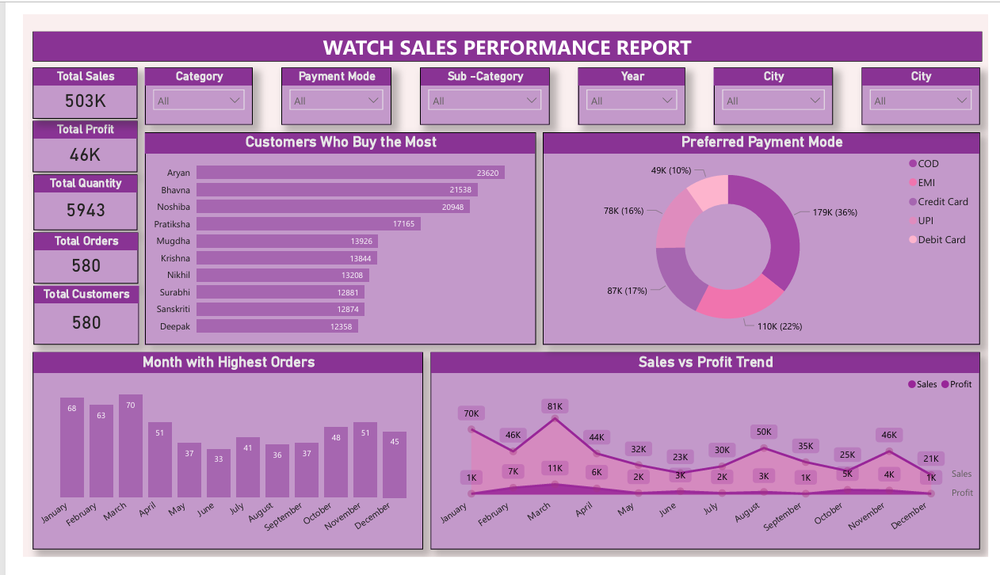
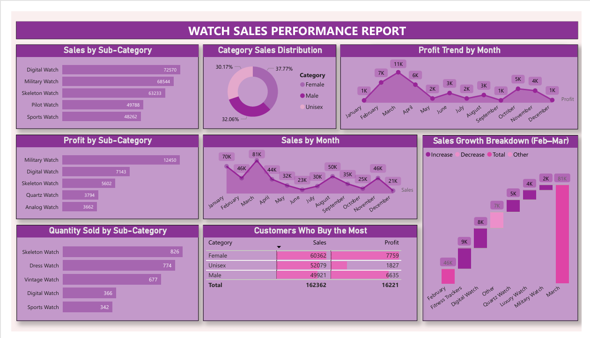

# Sales-Performance-Dashboard
Interactive Sales Performance Dashboard built using Power BI.
# Sales Performance Dashboard 📈

## Project Overview

This Power BI dashboard provides insights into sales performance, profitability, customer behavior, and product trends. The dashboard enables business users to monitor KPIs and identify growth opportunities through interactive visualizations.

## Tools Used

- Power BI
- DAX
- Power Query
- Excel

## Key Metrics

- Total Sales: 503K
- Total Profit: 46K
- Total Quantity Sold: 5943
- Total Orders: 580
- Total Customers: 580

## Dashboard Features

- Sales & Profit KPI Tracking
- Customer Purchase Analysis
- Preferred Payment Mode Analysis
- Monthly Sales Trend Analysis
- Product Performance Analysis
- Category Sales Distribution
- Sales Growth Breakdown

## Key Insights

- March recorded the highest sales performance.
- COD was the most preferred payment mode.
- Digital and Military Watches generated strong sales performance.
- Military Watches contributed the highest profit among sub-categories.
- Sales performance varied significantly across months.

## Dashboard Preview

### Overview

### Product Performance

